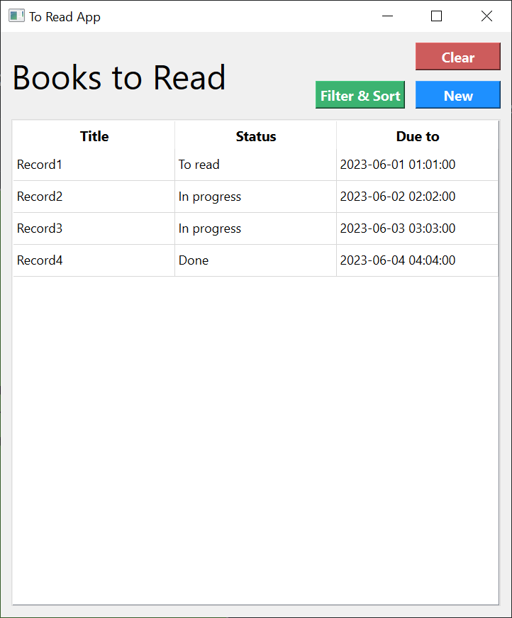
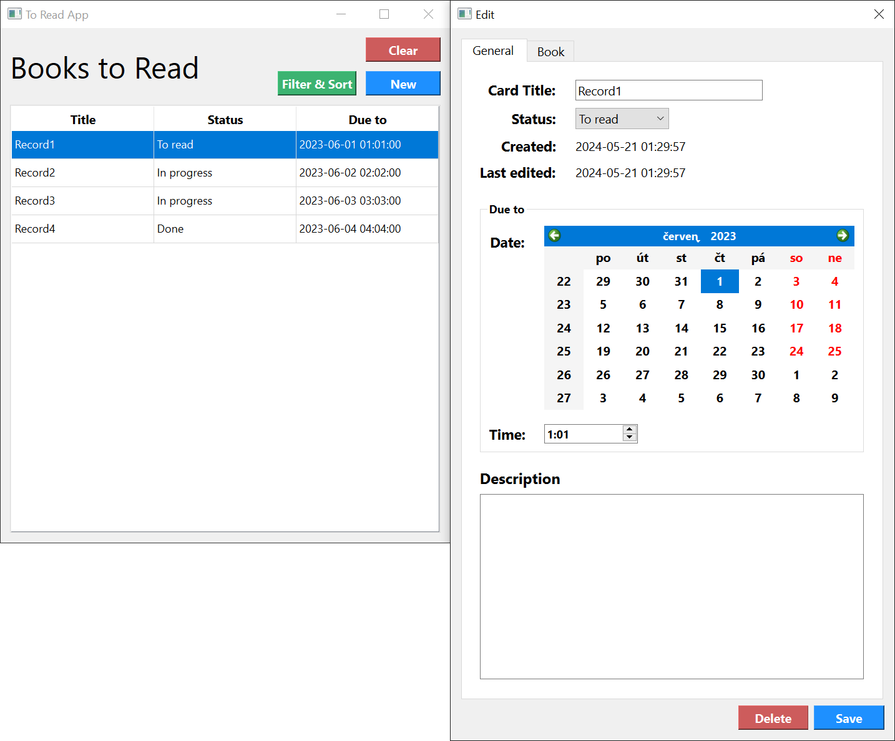
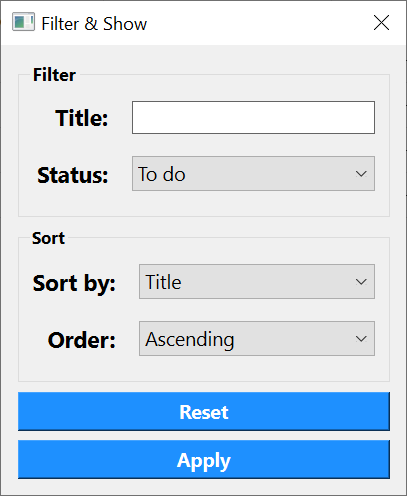

# To read app

- This is the second project in the URO school course. The focus of this project is to try using Qt with C++.

- **This project is not fully functional and is more of a demonstration.**

## Description
A very simple Qt application in the style of "ToDo" lists with a specific focus on books.
You can create new entries, delete entries, and edit entries. The filter/sort functionality
isn't implemented.

## Views

### Main window

### Card window - new card or existing card

### Filter sort window - currently without functionality

